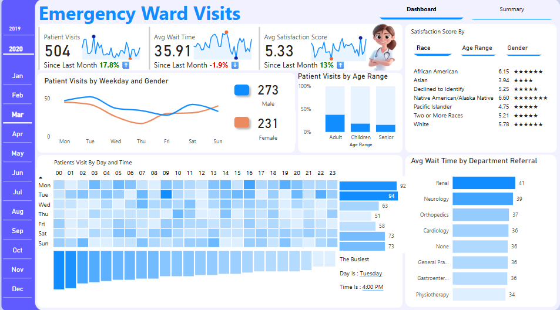

# 🏥 Emergency Visits Dashboard

An interactive Power BI dashboard that analyzes emergency room visits, identifies high-traffic time slots, evaluates patient satisfaction, and tracks average wait times across departments. Includes a searchable patient record table for audits and reviews.

---

## 🎯 Objective

To develop a comprehensive Power BI report that provides insights into patient flow, peak times, satisfaction ratings, and departmental performance — supporting hospital administrators in improving emergency care efficiency and patient experience.  
Additionally, a **Summary page** provides a searchable table of individual patient records for deeper review.

---

## 🛠️ Tools Used

- Power BI Desktop  
- DAX (Data Analysis Expressions)  
- Power Query  
- Custom Visuals & Icons

---

## 📁 Dataset Overview

The dataset includes emergency visit records with the following attributes:

- `Date`, `Time`, `Name`, `Gender`, `Age Range`, `Race`
- `Department Referral`
- `Wait Time (in minutes)`
- `Satisfaction Score (1–10)`

---

## ✅ Project Requirements & Tasks

| Task No. | Task Description |
|----------|------------------|
| 1 | Create Calendar table (Date, Month, Year, DayName, WeekdayNum, Hour) |
| 2 | Build relationships between calendar and ER visit data |
| 3 | Calculate KPIs: Total Visits, Avg Wait Time, Satisfaction Score |
| 4 | DAX measures for MoM % change indicators |
| 5 | Segment patients by Gender, Age, and Race |
| 6 | Identify busiest weekday and hour (TOPN + SUMMARIZE) |
| 7 | Visualize visits by weekday and gender (line chart) |
| 8 | Build day vs. hour heatmap matrix |
| 9 | Show average wait time by referral department |
| 10 | Add demographic-based satisfaction rating visuals |
| 11 | Implement dynamic slicers for Year and Month |
| 12 | Add page navigation between Dashboard and Summary |
| 13 | Style with custom colors, icons, and rounded visuals |
| 14 | Create a **Summary page** with searchable patient-level data |

---

## 📊 Visualizations

### 📍 **Dashboard Page**
- **📈 KPI Cards** – Patient Visits, Avg Wait Time, Avg Satisfaction Score
- **📉 Line Chart** – Visits by Weekday and Gender
- **🧊 Matrix Heatmap** – Visits by Day and Hour
- **🧑‍⚕️ Bar Charts** – Wait Time by Department Referral
- **👥 Bar Chart** – Visits by Age Range
- **🌟 Ratings** – Satisfaction Score by Race
- **🗓️ Dynamic Labels** – Busiest Day & Time
- **📅 Slicers** – Year and Month navigation
- **🔁 Page Navigation** – Between Dashboard and Summary

### 📍 **Summary Page**
- **📋 Table** – Detailed records of all emergency visits
- **🔍 Search Functionality** – Filter patients by name using a slicer or search box
- Includes columns like:
  - Patient Name
  - Date & Time of Visit
  - Gender & Age Range
  - Referred Department
  - Wait Time
  - Satisfaction Score

---

